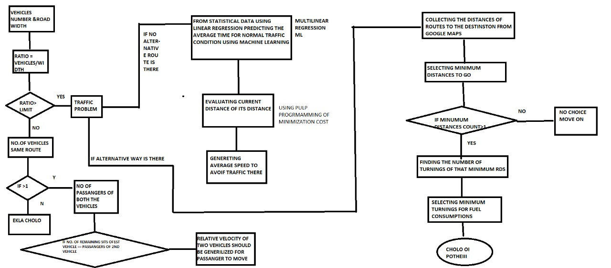

## Recursion - Transport
-Arya Sengupta
-Prithwish Mandal
-Monimoy Pal
-Arnab Sarkar

### Project Overview
----------------------------------
Public transit system and carpooling to prevent ecological damage and build better economy through reducing costs and import of fuel.
We have a public transport system mainly comprised of trains and large network of roads.Buses have designated routes however the system is outdated and in need of modernization.
In India 22 of a thousand people own cars which might not seem a lot unless we take a look at the total population.And half of these cars travel with only 1 person on board. Carpooling services must be started in order to curb this .
### Solution Description
----------------------------------
The buses will be tracked in real time using geolocation of a user on the bus.Our processes.py program will check the traffic in the next stop using satellite images so the exact ETA will be calculated. Hence it will precisely track and give the ETA of the bus to the user at the next bus stop.According to the traffic on the next stop the program will search for a better route.

There will be an option to search for carpools. 
This would give the people who are travelling in the same route. When a user 1 is driving, the app will ask for the seats available. If a seat is available it would notify user 2 who is waiting for a ride if they are traveling in the same direction.This would be a more feasible form of carpooling rather than pre-arranged network of carpools.
 Our program will also choose the route which takes less fuel.
 
#### Architecture Diagram

#### Technical Description
Add api key in geolocation.js
Add sample image file in process.py

### Team Members
----------------------------------

-Arya Sengupta, 1829047@kiit.ac.in
-Prithwish Mandal, 1829079@kiit.ac.in
-Monimoy Pal, 1829069@kiit.ac.in
-Arnab Sarkar, 1829045@kiit.ac.in
